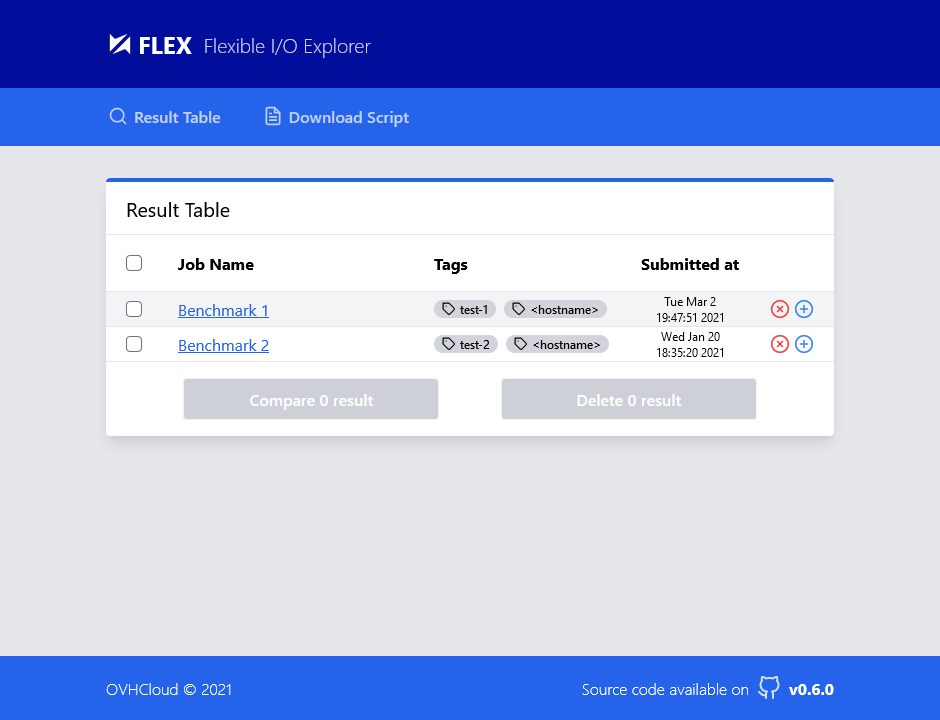
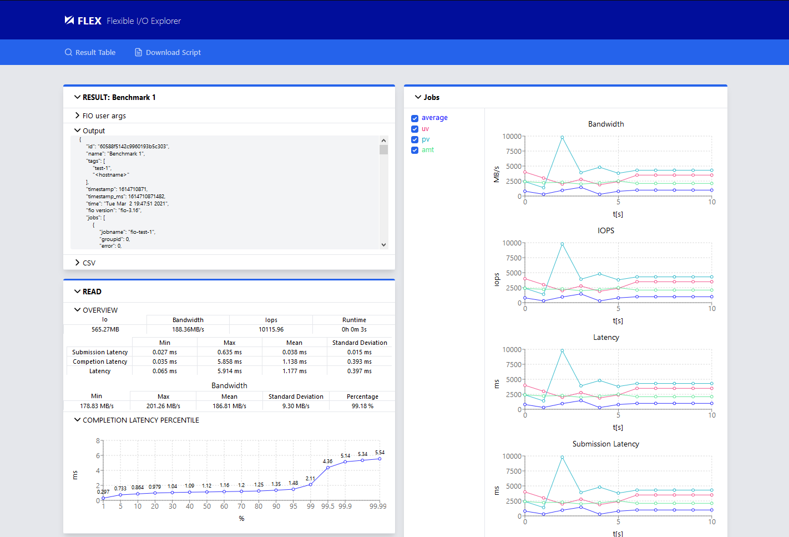

<!-- Logo -->

  

<!-- Name -->
<h1 align="center">
  <a href="https://github.com/IMT-Atlantique-FIP2021/fiowebviewer/"><b>FLEX</b> Flexible I/O Explorer</a>
</h1>

This web applications allows to store, view and compare [fio](https://github.com/axboe/fio) results using a web interface.

It is composed of two parts:
- Frontend written with [React](https://reactjs.org/) (JS Framework) and [Tailwindcss](https://tailwindcss.com/) (CSS Framework)
- Backend written with [FastAPI](https://fastapi.tiangolo.com/) (Python Rest API Framework)

For ease of development, we provide docker images for each part.
And for the deployment, we created a [docker-compose](docker-compose.yml) file that setup everything for you.

Fio web viewer is released under modified BSD license. See [license](LICENSE).

## How does it work?

- Run fio with script on target machine to gather results and logs. They will be sent to FLEX when fio finishes ;
- FLEX processes and stores the fio results and allows the user to view and *compare different runs** ;
- fio runs will appear on the main page of the application in a list, it is possible to name selected runs and add tags to them.

## How to use it?

### FLEX Script usage

> TODO...

### FLEX Web Interface

> Main page from frontend

Web interface has fio results listed on the main page with their name and with tags. 
The user is able to click on a particular fio run to view their details including *plots for aggregated jobs**, *fio command line arguments** and summary about the particular run.

> Result page from frontend

The data granularity on the plots is automatically scaled. User is able to zoom the plots.

*WIP*
> Compare page from frontend

The user can select several fio runs and click the Compare button. The comparison page will be displayed, where the summary of compared and aggregated runs is displayed on the same plots.

## Notes

> **Work in progress*
